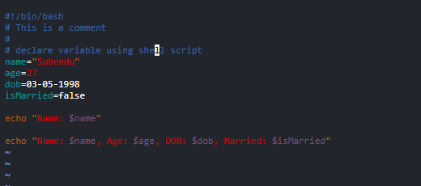
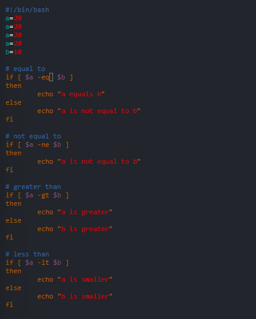
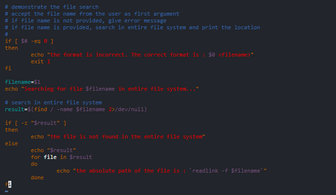
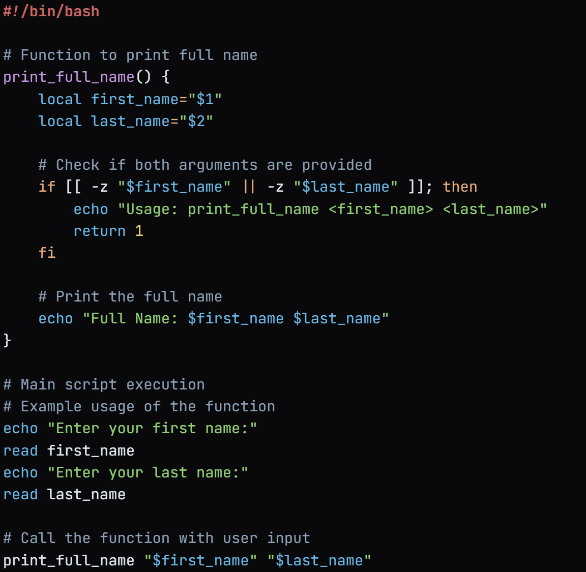

# Executing Shell scripts

echo "vim-commands" > vi_commands.txt -> will create a file and add the text in it

vi vi_commands.txt -> we can edit the file here

## Vim commads is divided into 2 modes

1. Command mode - copy,paste,move,delete,search -> we do it with esc key
2. Editor mode - inserting text -> keys used are i,a,o,O

By default it will be in command mode

To go to begining of next word -> w 
To go to 2 words forward -> 2w

To go to end of next word -> e

To go one word backward -> b
To go 5 words backwards -> b

To go one line below -> j

To go one line up -> k

To go one character right at a time -> l

To go one character left/back -> h

To go to end of the line -> $

To go to begining of the line -> 0

To delete a word forward-> dw 
To delete 5 words -> 5dw

To delete a word backword-> db 
To delete 3 words backward -> 3db

To delete till the end of current line -> d$

To delete till the begining of current line -> d0

To delete the entire line where the cursor is located -> dd

To go to end of the file -> shift + G

To go to the begining of the file -> gg

To delete entire content -> dG

Undo -> u

To save -> :w

To save and exit -> :wq

To exit without saving -> :q!

To exit force without saving -. :qa!

Yank or copy the line -> yy
Copy 3 lines from where the cursor -> 3yy

Paste -> p

To move to 3rd line -> :3

To insert from the cursor -> i

To insert new line below from cursor -> o

To insert new line above/previous from cursor -> O

To insert from the begining of the line -> I

To insert from the end of the line -> A

To delete character under cursor and go to insert mode -> s

To delete current line under cursor and go to insert mode -> S

To go to specific word -> /word then enter

To go to next occurence forward -> n

To go to next occurence forward -> shift + n

To replace all words -> :%s/wordToChange/ChangedWord/g

## Advantages of using shell script

1. Scripts can execute commands much faster than manual execution.
   This is especially beneficial for tasks that require running multiple commands sequentially.

2. Shell scripts use a straightforward syntax that is easy to learn, making
   it accessible for users with varying levels of programming experience. Modifying scripts is also relatively simple.

3. Shell scripts can easily integrate with other command-line tools and utilities,
   allowing for complex workflows that combine multiple commands and applications.

4. Many shell scripts can run on different Unix-like systems (Linux, macOS, etc.)
   with minimal changes, making them versatile for cross-platform environments.

5. Shell scripts have direct access to system commands and utilities, allowing for
   powerful system management and automation.

6. Shell scripts can include error-checking mechanisms, allowing for more robust
   automation by handling unexpected situations graceful

7. Shell scripts can be easily shared and deployed across different systems, making
   it easy to replicate environments or share solutions among team members.

## Start

You can directly create a file and go to edit mode -> vi fileName.bash

<b>#!/bin/bash</b> 
The line #!/bin/bash at the beginning of a script is known as a hashbang. It indicates
which interpreter should be used to execute the script. In this case, it specifies that
the script should be run using the Bash shell.

chmod 755 fileName.sh

sh fileName.sh

;; -> break

return 0 -> success
return 1 -> error
