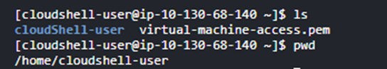

# EC2 instance

On this

1. We need to provide a meaningful name
2. AMI (Application machine image) – the OS we want to use in our application

Instance type: Its configuration required

Key Pair: For authentication

As soon as we create, a file will be downloaded

For more security 
SSH stands for Secure Shell. It is a cryptographic network protocol used to securely access and manage devices over an unsecured network. SSH provides a secure channel for sending commands and transferring data, ensuring confidentiality and integrity through encryption and authentication mechanisms.

By default, no off instance is 1, But it can be increased or decreased according to the usage

Now to connect with this, open cloudshell

Upload your key pair file

The file will be uploaded in present working directory(pwd)

Get public address

ec2-user is default user name

The key file shouldn’t be in executable or write state and it mustn’t be read by any other user

In Linux, there are 3 users

1. Current user
2. Group user
3. Others

For file, we have Read (4), Write (2) & Execute (1) permissions 
7: 4 2 1

If for some file, 777: all users have all access to the file

If for some file, 444: all users have read access to the file

If for some file, 400: current user has read permission while other users don’t have any

The Ip address has been attached with the terminal line now.
And now we landed to home directory of ec2-user.
After these we can do anything on this instance.

You can create now as many instances as you want by this process.
