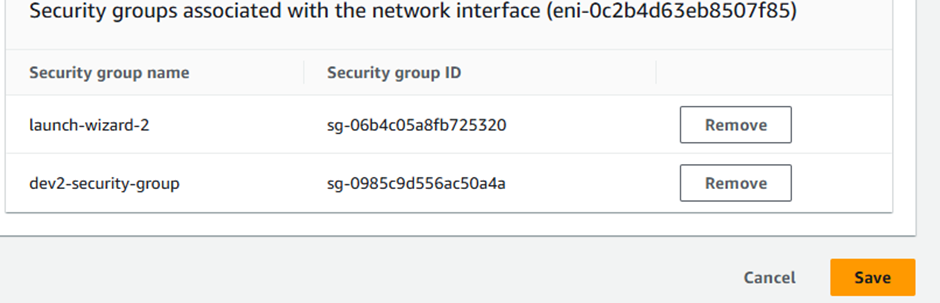

If none is selected from ssh group

Now if we try to connect it won’t happen, as there is no ssh permission

### Inbound connection

Client tries to connect with EC2 instance

### Outbound connection

Instance tries to connect with outer Api’s

We need mechanism where we can perform both.These can be done through Security Groups.

For http: default port is 80

For ssh: default port is 22

For https: default port is 443

For MySQL: default port is 3306

For MongoDB: default port is 27017

For source: choose ipv4 => so that anyone can connect with the key file

Now we need to attach these to our instance required

## When we want to use same key pair

Using key pair used by 1st dev

#### If we remove security group, the effect will take immediately.The user working on the instance will get immediate changes.
