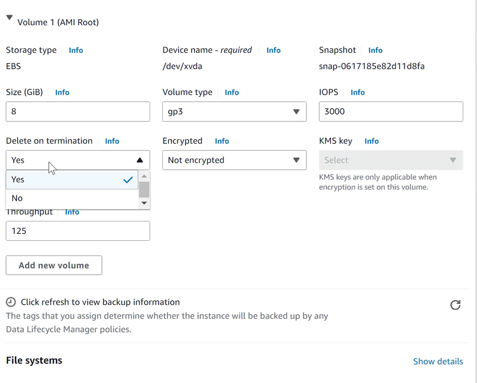

# With windows – We can perform the same operations from gitbash

When we start and stop an instance, the public IP may change.

## When we create an instance and add a normal storage

So, when we terminate the instance, the storage will be terminated with it.
These is default behaviour.

## We can select advanced option for storage

We can select no on termination, so volume won’t get deleted after termination of instance
