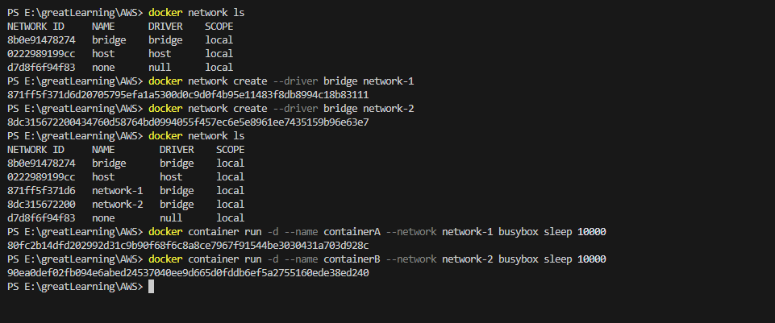
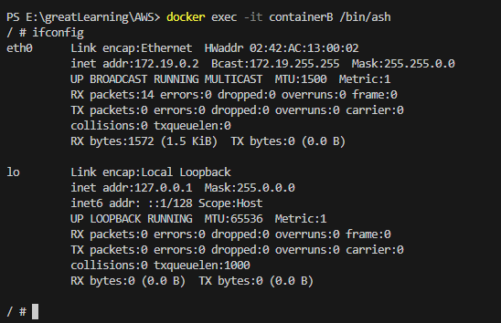
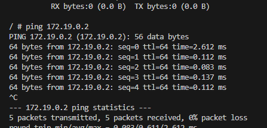
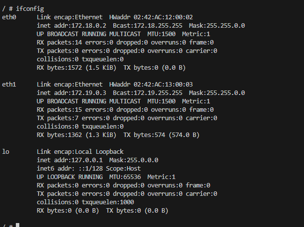

# For connecting 2 containers of different network

## docker network connect network-2 containerA

So with this, we are also adding network-2 for containerA

Now it have one ip of network-1 and other of network-2.

So with this, network-2 have IP registered of container A.Thus, any container of network-2 now can connect with container A.
