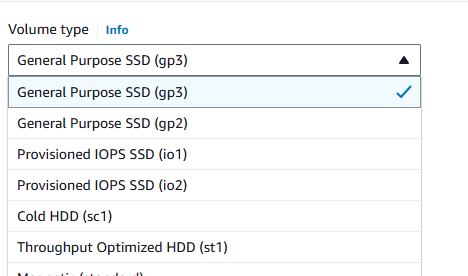
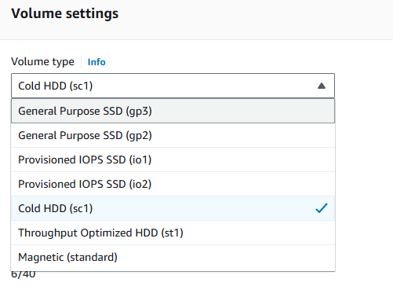

App -> Banking ( online based)

1. View transaction
2. Initiate Transaction
3. OTP

App - Offline based

1. Producing reports
2. Analysis

## Transactional based Applications

Operations initiated will be short lived

For transaction - their will be frequent read and write operations

For these purpose, we should use General pupose or
Provisioned IOPS

<b>ThroughPUT</b> -> Throughput in database terms refers to the amount of data or the number of transactions that a database can process within a specific time frame. It is typically measured in transactions per second (TPS) for online transaction processing (OLTP) systems.

More the though put, more will be the data flow

## Analytical based Applications

Reports, data analyzing

We are more concerned on volume for these

So for these, we will go for Cold HDD, ThroughPut Optimized HDD, Magnetic

# Storages

## EBS (Elastic Block Store)

Type: Block storage.

Accessibility: Can be attached to a single EC2 instance at a time.

Performance: Offers high performance with low-latency access, suitable for applications requiring fast data retrieval.

#### Low latency access refers to the ability to retrieve or store data with minimal delay.

Use Cases: Ideal for databases, transactional applications, and workloads that require consistent and predictable performance.

Snapshots: Supports creating snapshots for backup and recovery, which can be stored in Amazon S3.

Cost: Generally more cost-effective for single-instance use compared to EFS.

## EFS (Elastic File Store)

Type: File storage.

Accessibility: Can be accessed by multiple EC2 instances simultaneously, making it suitable for shared file storage.

Performance: Scalable performance that can grow with your application needs, providing low-latency access.

Use Cases: Best for applications that require shared access to files, such as content management systems, big data analytics, and web serving.

Durability: Automatically replicates data across multiple Availability Zones for high availability and durability.

Cost: Typically more expensive than EBS, but offers flexibility for applications needing shared access

## S3

Type: Object storage.

Accessibility: Accessible over the internet and can store an unlimited amount of data.

Performance: Optimized for high durability and availability, but not as fast as EBS or EFS for random access.

Use Cases: Ideal for storing large amounts of unstructured data, such as backups, media files, and static website content.

Cost: Generally the most cost-effective option for large-scale storage, especially for infrequently accessed data.

Data Management: Supports features like versioning, lifecycle policies, and cross-region replication.
