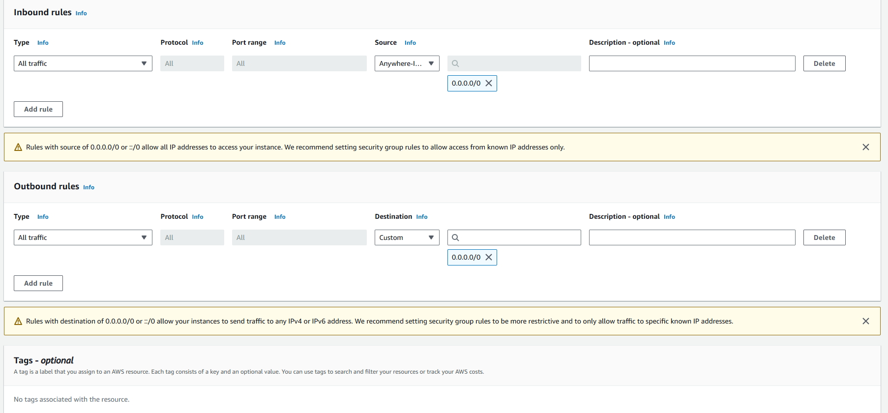
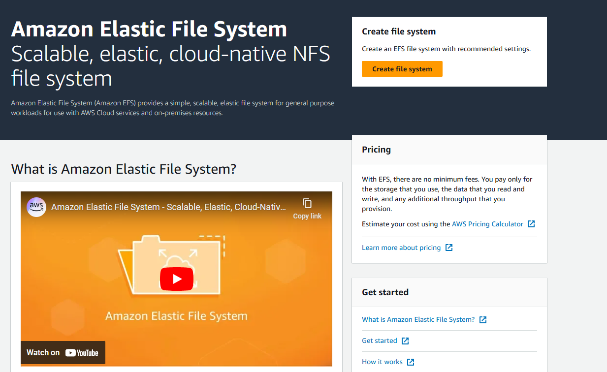
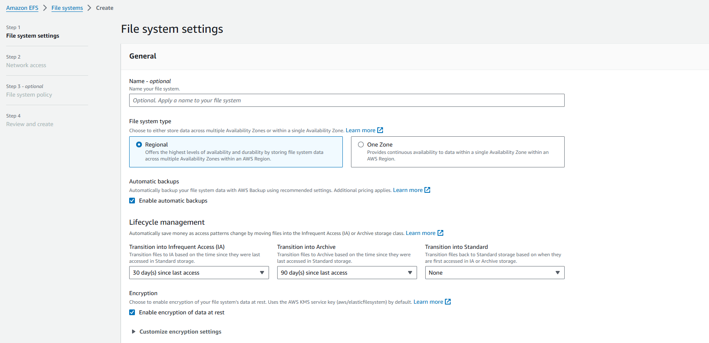
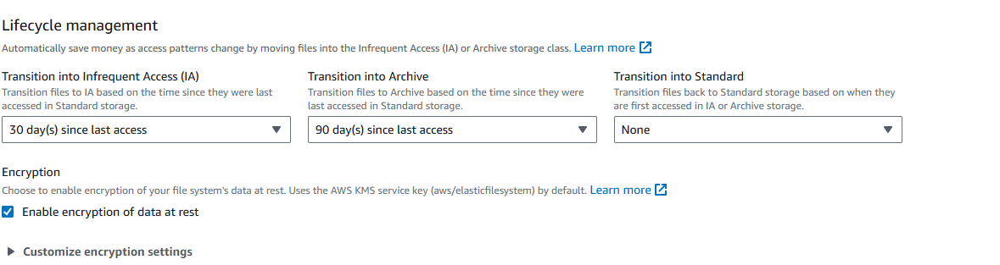
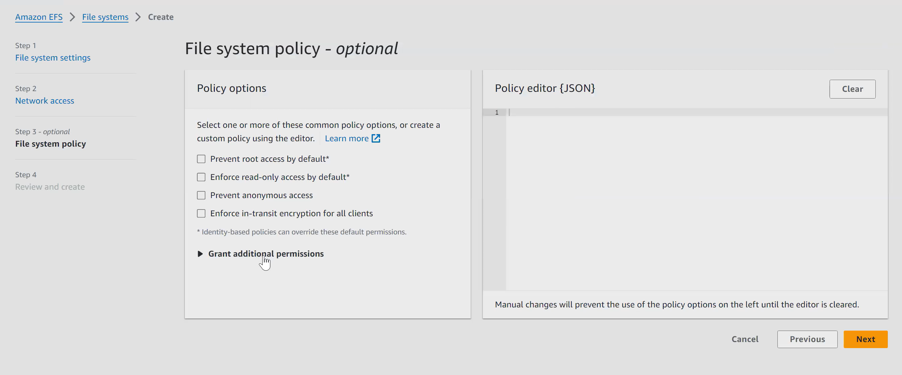
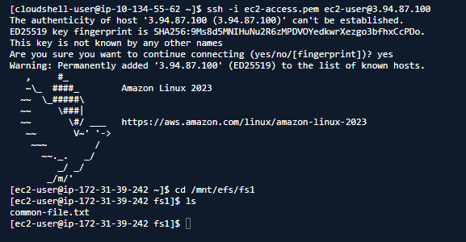

Creating a security group for connecting with EC2 instances and EFS storage

For EBS - we have to define for initial capacity

For EFS - we don't have to define initial capacity. It will be completely automated.

it will be very much expensive than EBS.

Using customize option

The lifecycle of data can be managed too

By default, it will be in <b>Standard Tier/Layer (FA)</b>

It will move to <b>Infrequent Tier/Layer/Access (IA)</b> after the option been selected

After that it will move to <b>Archieve Layer</b>

After these, if user tries to access the file, we have 2 options

1. Back to Standard mode
2. None - Will be like that as how it is now

Going with default for now

#### Mount targets

For different instances to connect with these EFS file system. 
So for these some king of interface is required for these. 
So, mount targets works as network interface for EC2 instances to connect with the current EFS.

Added our won security group rather then default

=====================================================

Adding new Security Group for instance
And also add subnet

Choose advanced in storage and click on File systems

This is the one which is automatically created, while creating the instance as Automatically create and attach security groups was enabled

So from connecting EC2 to EFS, their is an outbound rule and NFS protocol is chosen for it. 
<b>NFS- Network based File Server</b> 

The target is matching with the EC2 instance security group 
The inbound represnts EC2 instance from prospective of EFS and from prospective of EC2 outbound represents EFS.

=====================================================

Creating instance B

=====================================================

Thus EFS will be a good choice when needed to be used in different region
