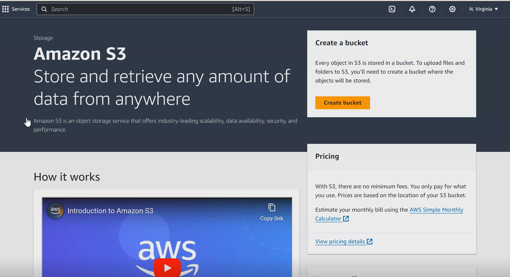
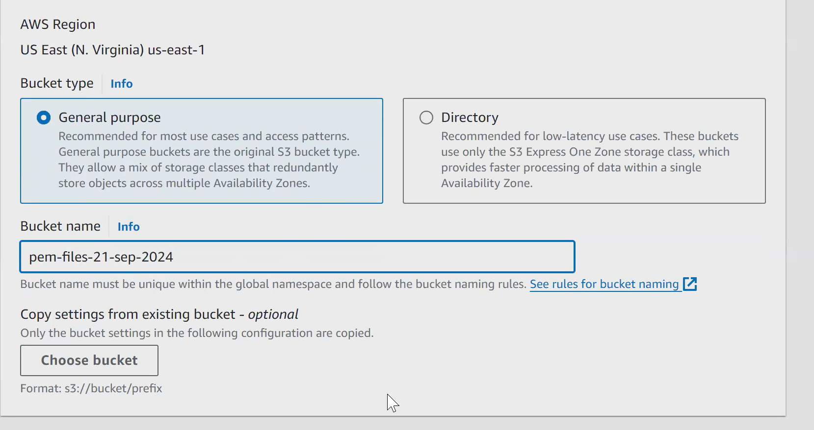
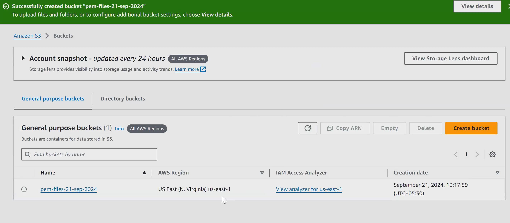

# AWS S3

For EC2 client - we can use EBS/EFS

For other clients - we can S3

As Google and Microsoft one drive, We can store files with AWS too using
AWS S3

#### objects

When it comes to storing file based data/objects, ebs & efs won't be great choices. 
In storage terms, when we say storage happening through files, means we are refering them as <b>objects</b>
 
So objects means files and folders.

In S3, we don't need to specify the capacity.

