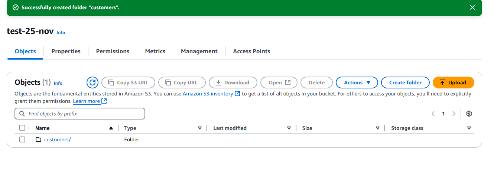
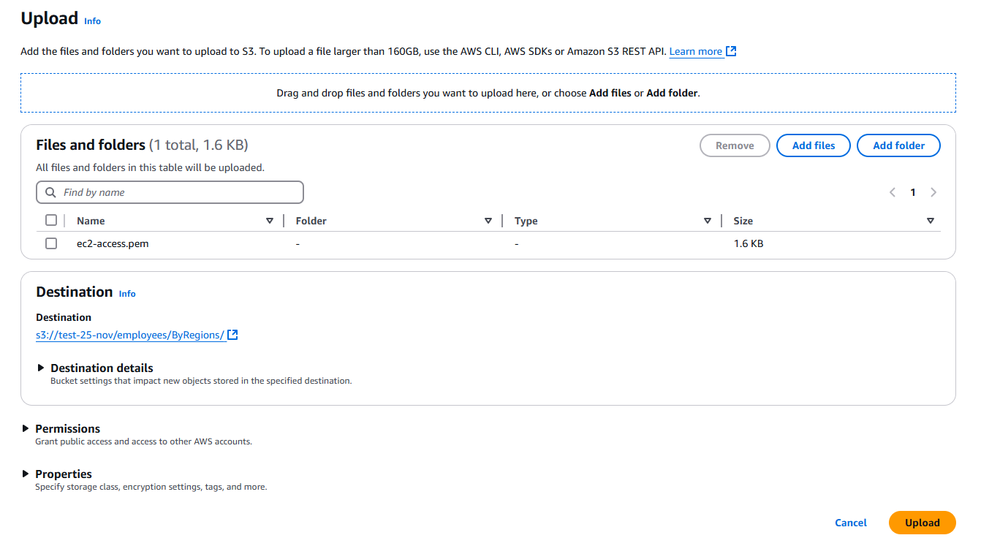
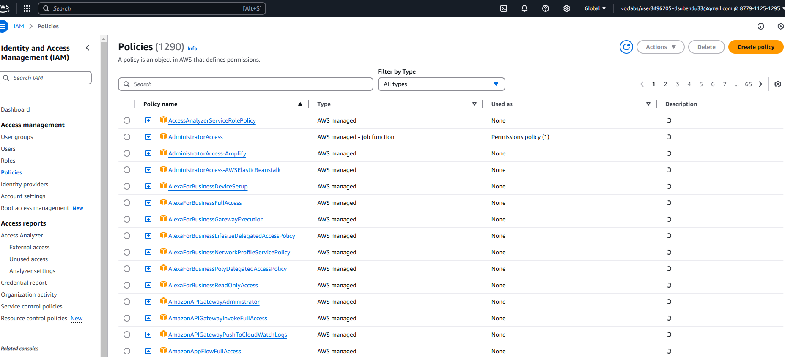
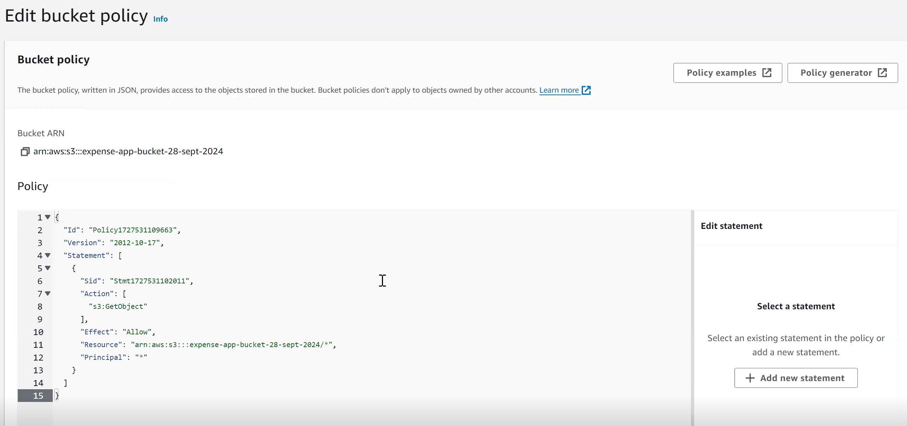

# AWS S3

For EC2 client - we can use EBS/EFS

For other clients - we can S3

As Google and Microsoft one drive, We can store files with AWS too using
AWS S3

#### objects

When it comes to storing file based data/objects, ebs & efs won't be great choices. 
In storage terms, when we say storage happening through files, means we are refering them as <b>objects</b>
 
So objects means files and folders.

In S3, we don't need to specify the capacity.

The created bucket name should be globally unique. 
It's also possible that we may use this bucket as a website.

We can add files using upload

===============================================================================

Converting into a website

After this, if we again go to the same property, we will find the link created.

We have to create a policy, so that we have access to all the files in S3 bucket.

Principal as \* for everyone otherwise we can add for different account-id's

Get the json in notepad and add /\* to allow nested structure folders and files too

Add & save changes

Now we will be able to access the url

===============================================================================

## For adding CORS rules

