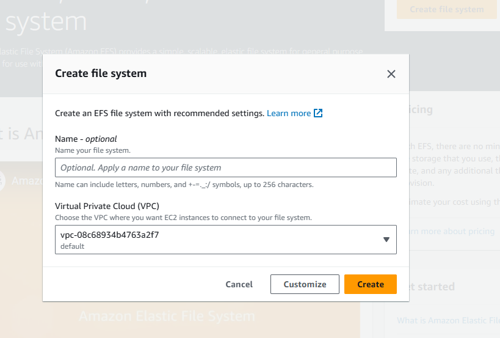

Creating a security group for connecting with EC2 instances and EFS storage

For EBS - we have to define for initial capacity

For EFS - we don't have to define initial capacity. It will be completely automated.

it will be very much expensive than EBS.

Using customize option

The lifecycle of data can be managed too

By default, it will be in <b>Standard Tier/Layer (FA)</b>

It will move to <b>Infrequent Tier/Layer (IFA)</b> after the option been selected

After that it will move to <b>Archieve Layer</b>

After these, if usre tries to access the file, we have 2 options

1. Back to Standard mode
2. None - Will be like that as how it is now

