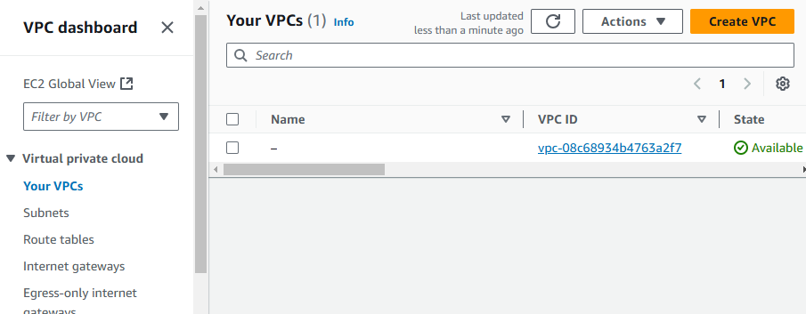
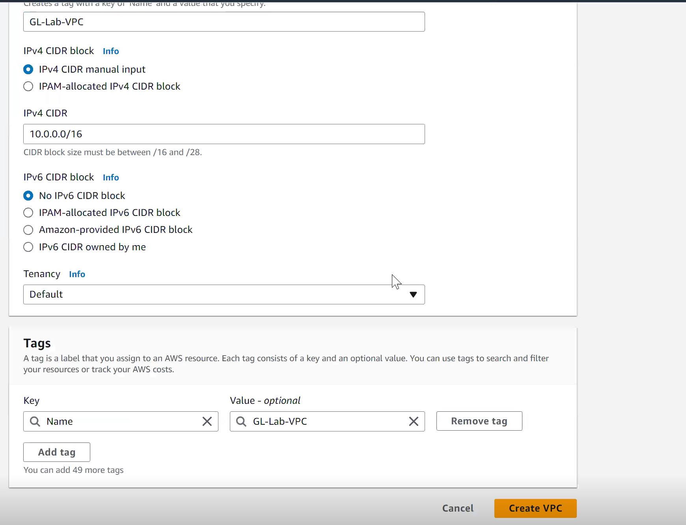
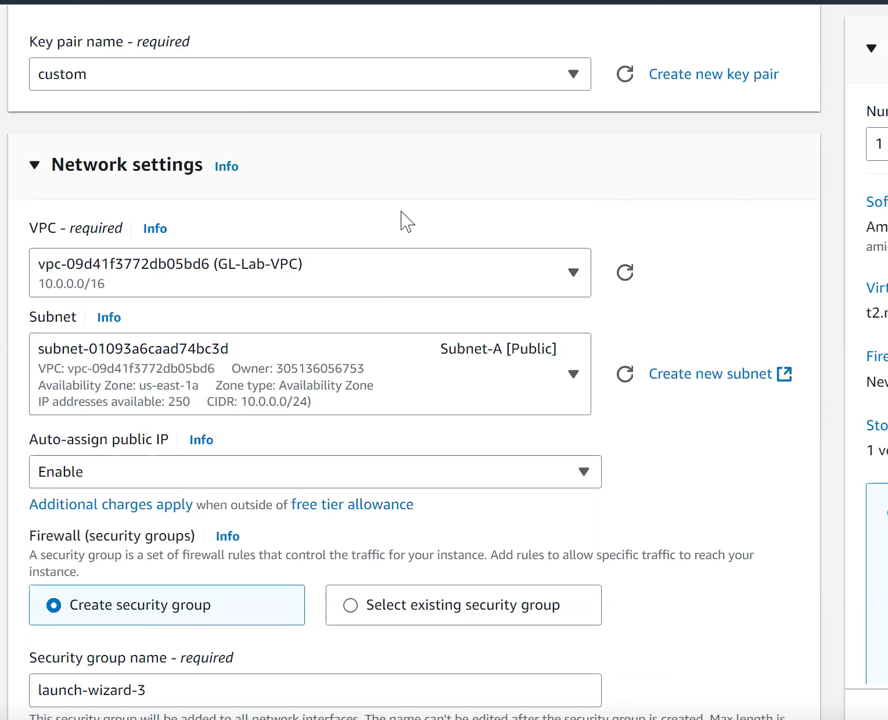
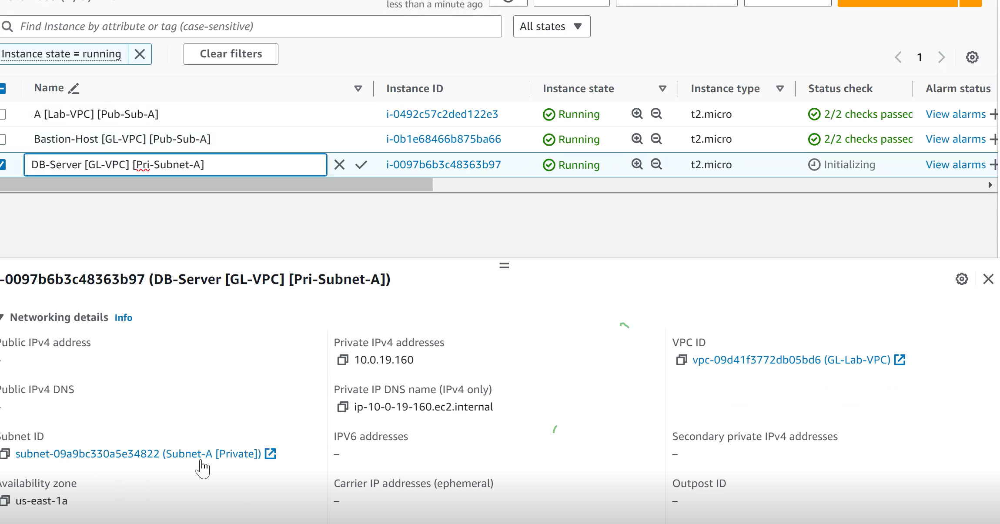

# AWS Networking

## VPC(Virtual Private Cloud)

A Virtual Private Cloud (VPC) is a secure and isolated section of a cloud service provider's infrastructure that allows users to run resources in a virtualized environment. It provides users with control over their virtual networking environment, including aspects like IP address range, subnets, route tables, and network gateways.

VPCs provide a logically isolated environment, ensuring that resources are not accessible to other tenants of the cloud provider.

VPCs can be easily scaled by adding or removing resources according to the needs of the application.

When we create an EC2 instance

So instance, security group, Load balancer etc. we create will be belong to VPC layer.

To avoid conflicts between resources

1. Region based isolation
2. Account level
3. VPC level

## CIDR

Classless Inter-Domain Routing (CIDR) is a method used for allocating IP addresses and IP routing that replaces the older system based on classes (Class A, B, and C).

https://www.ipaddressguide.com/cidr

1. IP Addressing: 
   In CIDR, an IP address is represented in the format A.B.C.D/N, where A.B.C.D is the IP address and N is the prefix length that indicates how many bits are used for the network part of the address. 
   For example, the CIDR notation 192.168.1.0/24 indicates that the first 24 bits are the network part, and the remaining bits are available for host addresses.

   0 to 255 goes for each A, B, C, D.

2. Subnetting: 
   CIDR allows for variable-length subnet masking (VLSM), which means that the subnet can be of any size, rather than being restricted to fixed classes. This flexibility helps in optimizing the allocation of IP addresses.

3. Aggregation: 
   CIDR supports route aggregation (also known as supernetting), which allows multiple IP addresses to be represented as a single routing entry. This reduces the size of routing tables and improves routing efficiency.

## Creating custom VPC

## Subnet

A subnet, or subnetwork, is a logically visible subdivision of an IP network. Subnetting is the practice of dividing a larger network into smaller, manageable segments or subnets. This practice is essential for improving network performance, enhancing security, and optimizing the use of IP address space.

Now while creating instance

Target here refers to whom we can connect

local value refers to connect for all ip addresses of VPC

So, now we can connect with it.

## Bash on EC2

"Bash on EC2," which typically means using a Bash shell on an Amazon EC2 (Elastic Compute Cloud) instance. EC2 is a web service that provides resizable compute capacity in the cloud, allowing users to run virtual servers (instances) on Amazon's infrastructure.

Public subnet can connect to private subnet as they belong to same vpc.

So, public subnet will be bash on host fro private subnet.

For establishing connection to private instance

No we are connected through Bash on host.

For private ntsance now to have external internet access, NAT gateways is present.

## NAT gateways

A NAT Gateway (Network Address Translation Gateway) is a managed AWS service that enables instances in a private subnet to connect to the internet or other AWS services while preventing the internet from initiating connections with those instances. NAT Gateways are commonly used in cloud architectures to allow outbound internet access for resources that do not have public IP addresses.

These NAT gateway in public subnet connected from private subnet will connect with internet gateway of public subnet to get internet access.

So for these we will add in Route table to connect with Nat gateway

Make sure the NAT gateway is available otherwise some config is wrong.

Now we have to make changes in private route table

Now by these ext internet will be available on private subnet

## Network ACLs

Network Access Control Lists (Network ACLs or NACLs) are a critical component of Amazon Web Services (AWS) networking that provide a way to control inbound and outbound traffic at the subnet level within a Virtual Private Cloud (VPC). They serve as an additional layer of security, complementing security groups, which operate at the instance level.

Adding security at subnet level

The first rule will take preference

So now it will be 2 layers on public subnet

1. NACL layer
2. Security group

We need to configure both for all permissions

So now, first rule of NACL is denying, it won't allow to pass through subnet level.

