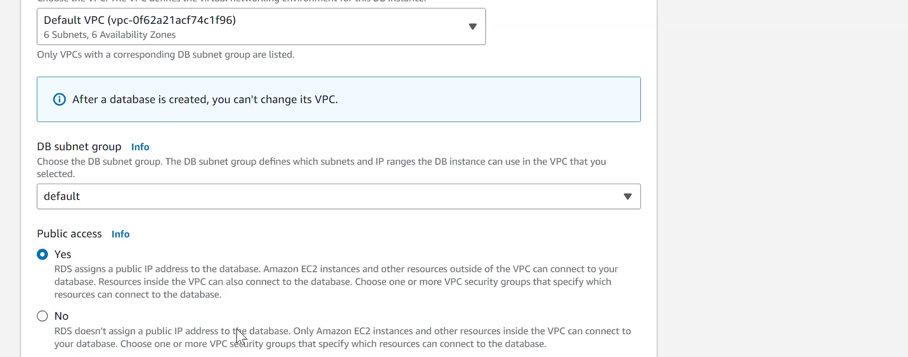
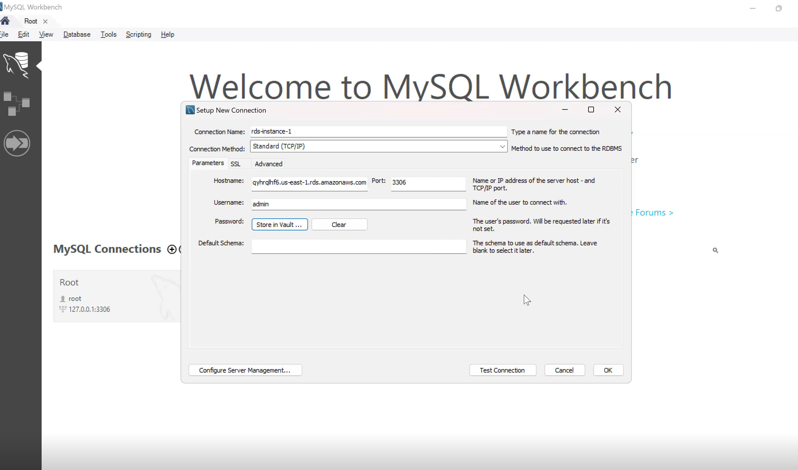

## RDS (Relational Database Service)

Amazon Relational Database Service (RDS) is a fully managed, open-source cloud database service offered by AWS. It allows users to easily operate and scale their relational databases in the cloud. With RDS, users can set up, operate, and scale a relational database in the AWS Cloud, supporting popular database engines such as MySQL, PostgreSQL, Oracle, SQL Server, and Amazon Aurora.

<b>RDS provides a managed database service, which means that AWS handles the database administration tasks, such as patching, backups, and scaling, allowing users to focus on their applications and services.</b>

Cons:

1. Takes a lot of time while creaing

We should set password according to the Db we choose

Their are to options to connect to RDS

1. Ext Client can connect
2. EC2 instance can connect

For ext client to connect , we need to enable the public access

If we enable this, by default we won't be able to delete.
We have to disable this and then only we will be able to delete this database

Edited the inbound rule created automatically by RDS

Any operation on the instance 1 wil be replicated to the replica instance instanteneously.

The replica instance will have only read access. We won't be able to modify anything from that instance.

We can create as many replica instance we want, and it will all work same
