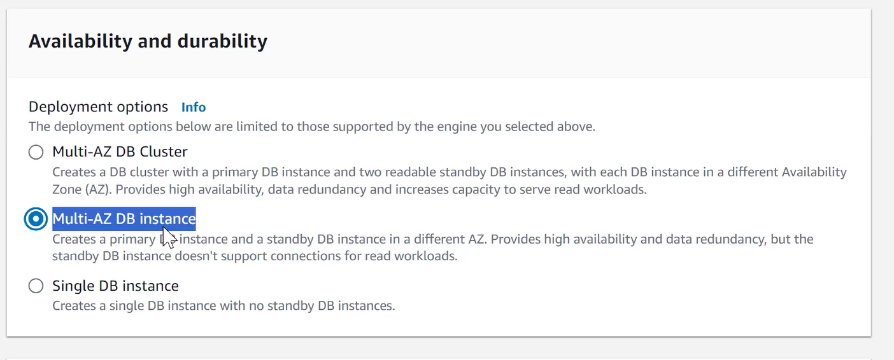
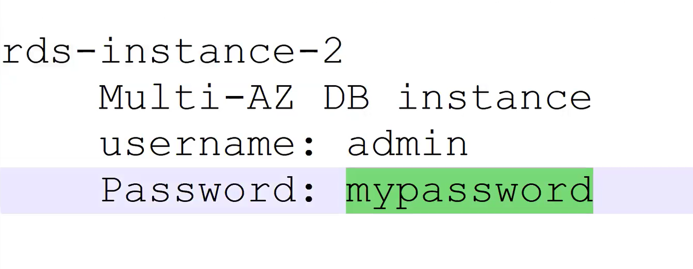
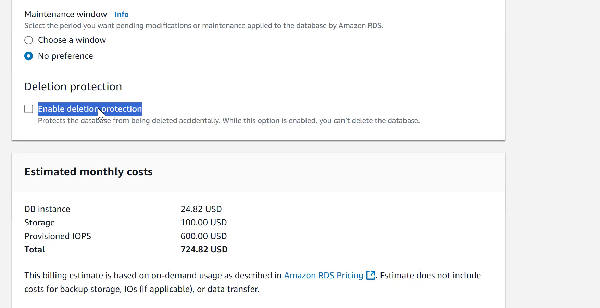
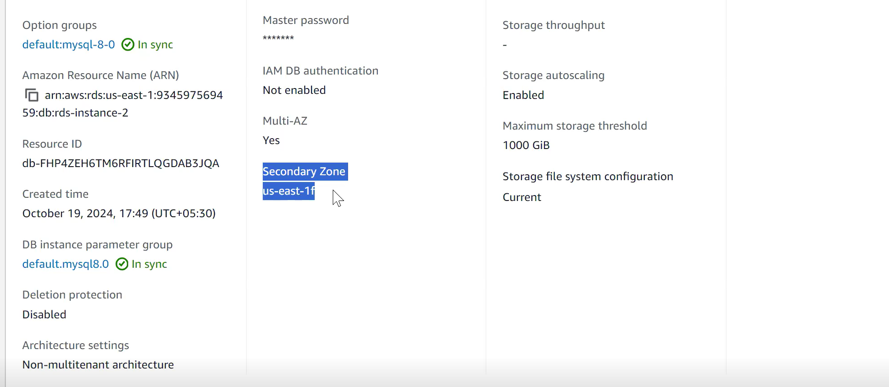
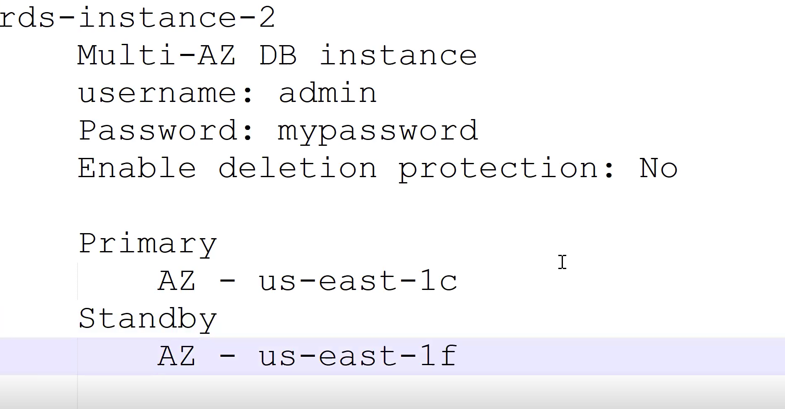
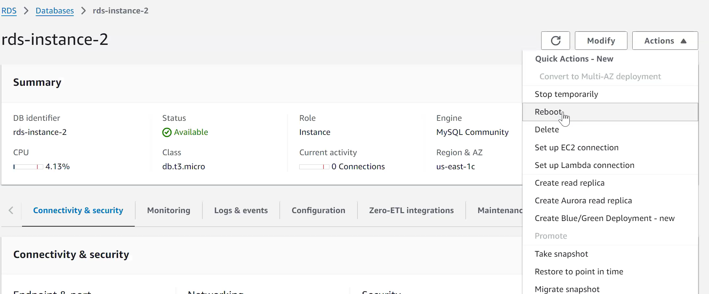
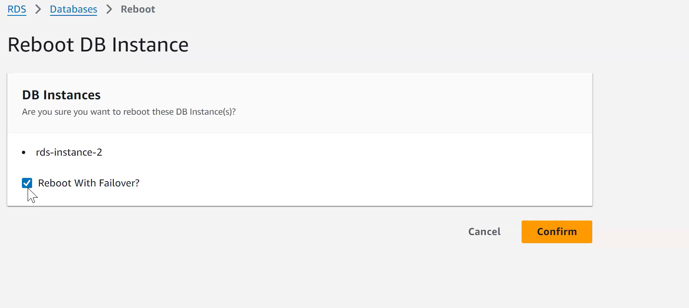
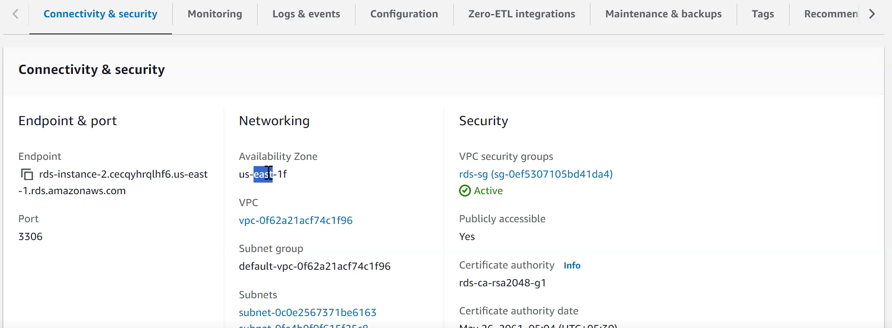
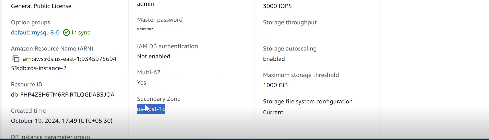

Creating a database with this option 
So, their will be secondary instances created & whenever their is some problem with primary instance, traffic is automatically redirected to secondary instance.

Removing deletion protection

AWS RDS don't provide information for these secondary instance as it automatically switches over when primary is down.

To check for secondary instance

Now the secondary instance becomes the primary and a new secondary instance is going to be at created which will be treated as secondary instance.

