## Amazon Dynamo Db - No Sql database

No rigid schema

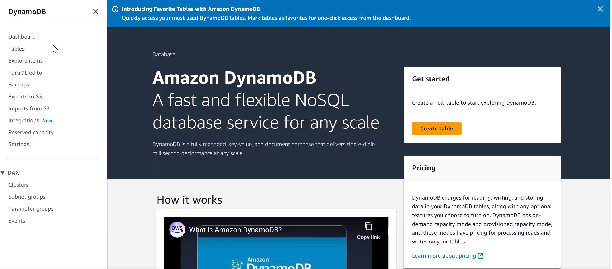

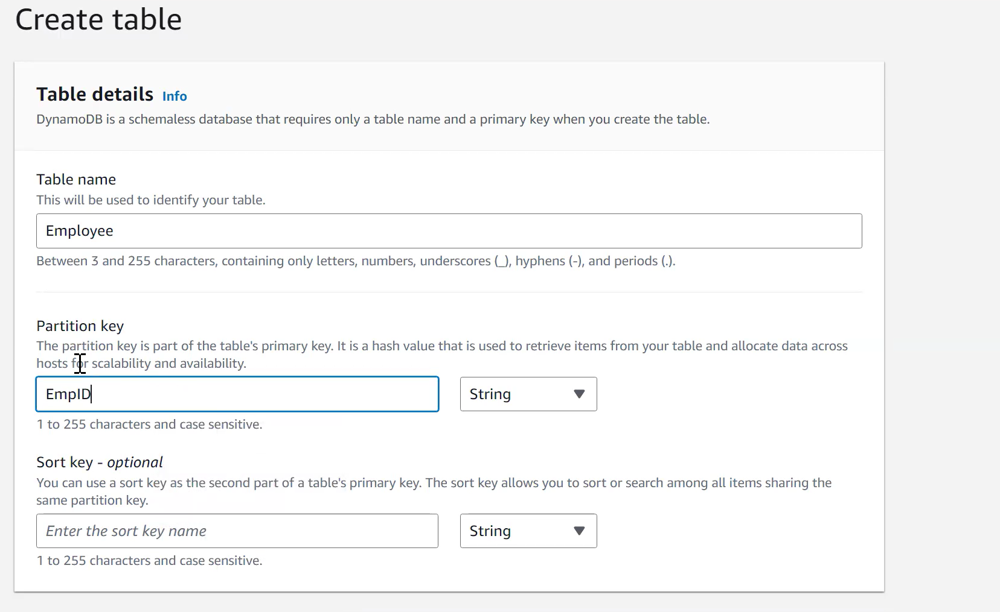

Partition key work as Primary key

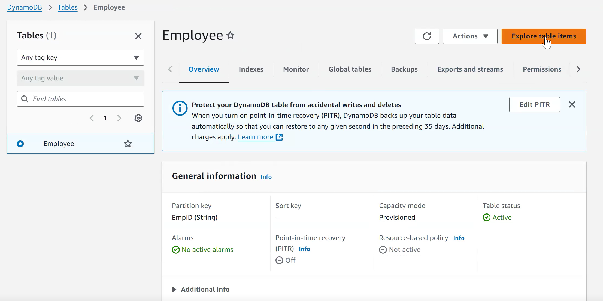

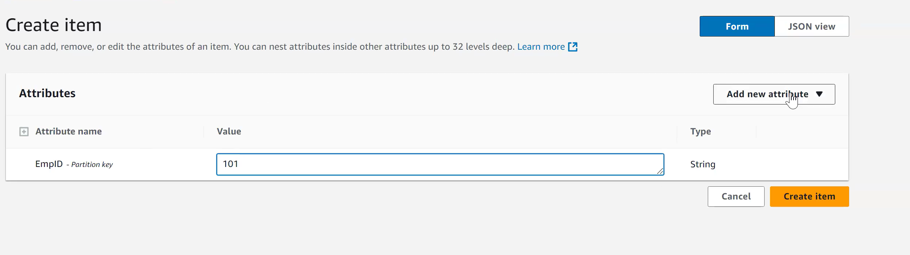

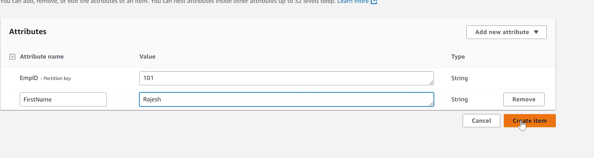

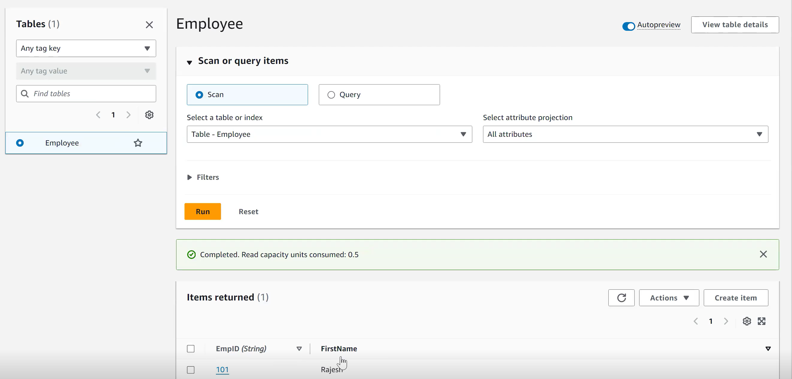

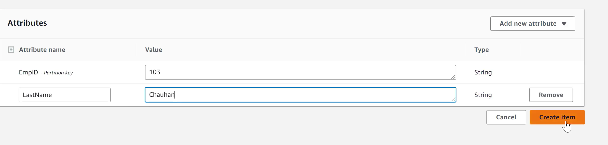

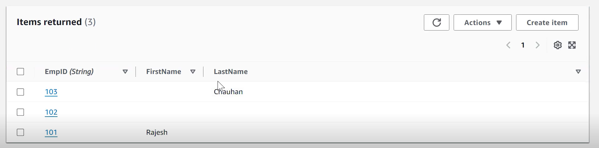

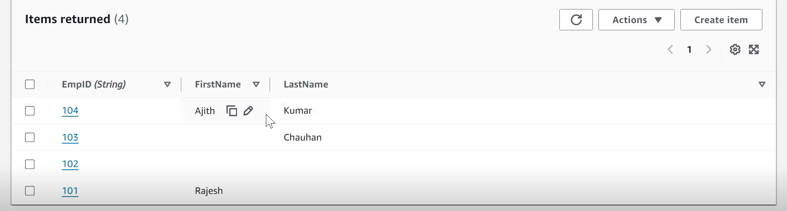

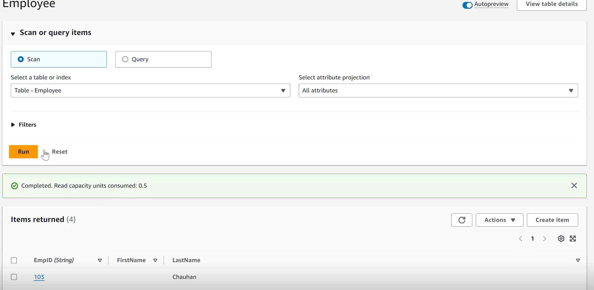

Scan is going to return all records of the table

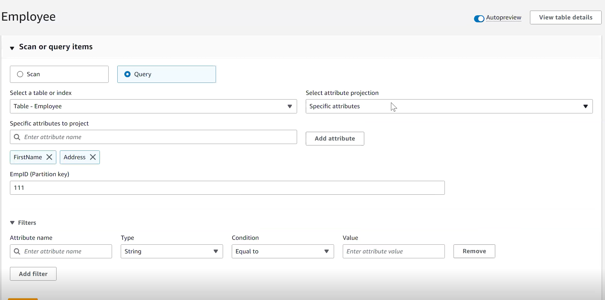

Query for returning specific

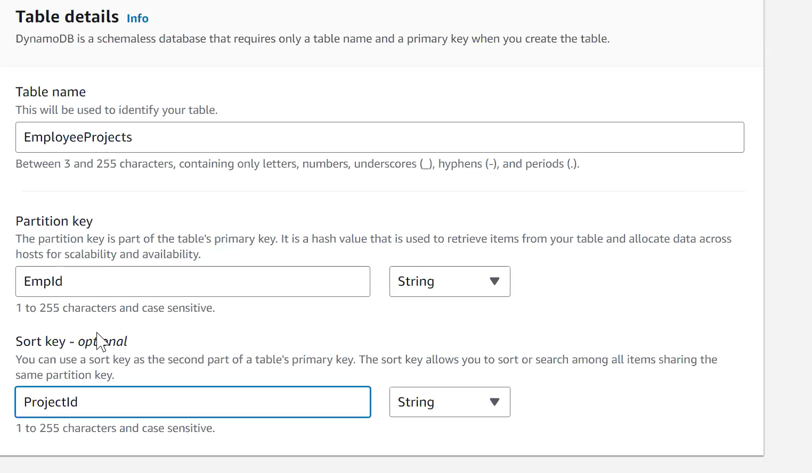

We can have composite value, where we can add 2 unique values

==========================================================

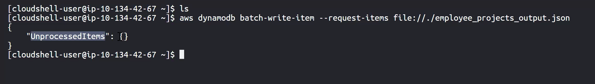

To add from console

All items are successfully processed

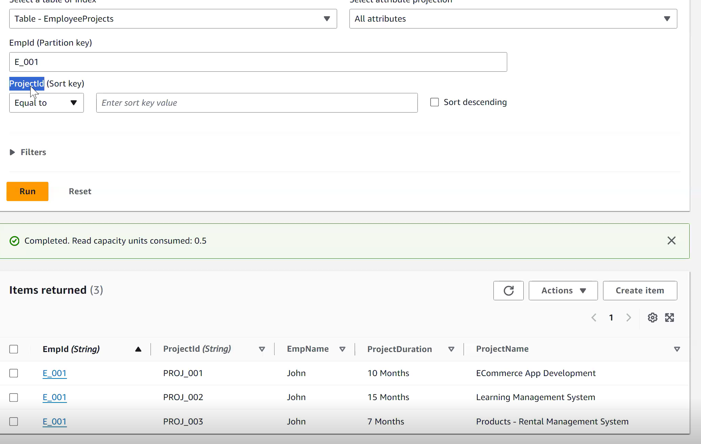

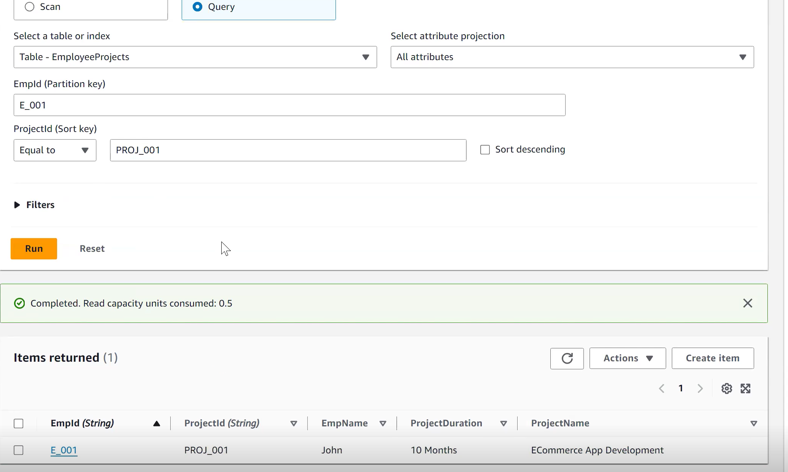
