1. Containers to connect with each other

2. Create an isolation level for group of containers

Host machine -> Internet -> Docker(where some containers are launched) ->
<b>Bridge Network</b> will be created, so with these containers and host
machine can communicate with each other

1. None network 
   Without bridge network, it will be completely isolated with the
   external world.
   We can also call these as <b>Close Container</b>

2. Bridge Network 
   With use of this network, containers will be able to access the host machine
   and then they can access the internet

## docker network ls

To get all the networks available

## docker network rm name

To delete the network available

## docker container run --name c1 --net none busybox

using none network

## docker container run --name c1 --net none busybox sleep 10000

Adding sleep so that container get running till 10000, as the container was existing
on run

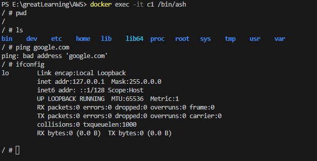

So after connecting to the container, if we are tring to ping google,
its unable to connect

## docker container run --name c2 busybox sleep 10000

If we don't specify any network, it will be using Bridge network

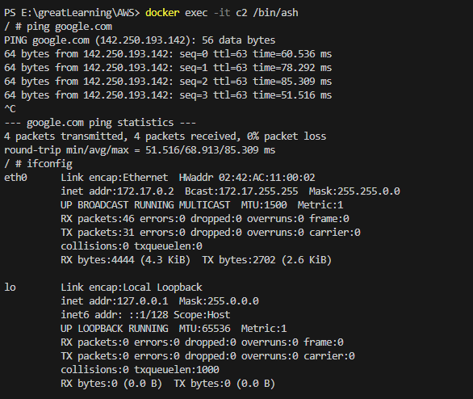

For bridge network, we are able to ping Google
 
Also for eonnecting to internet we have eth0

## docker network create --driver bridge nameForTheNetwork

To create owr own network

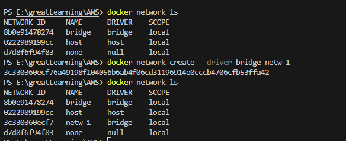

## docker network inspect netw-1

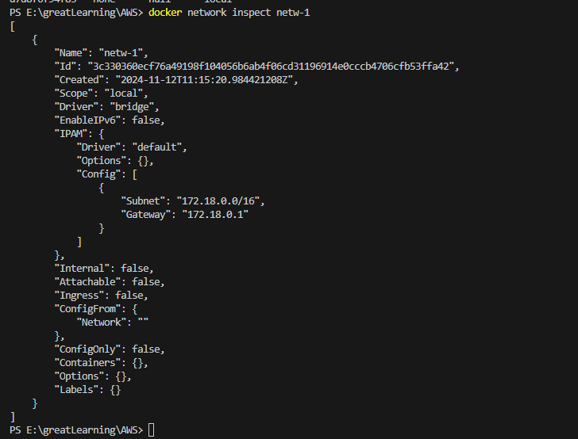

Inspecting a network

Every network will have its capacity for how much devices it can connect with

Every device will have its own IP address

https://www.ipaddressguide.com/cidr

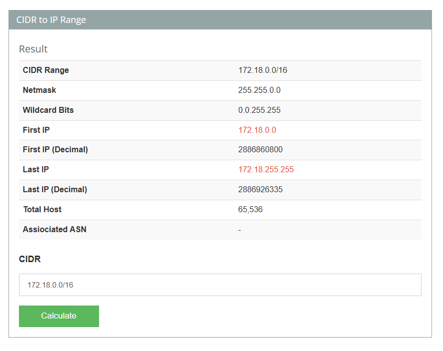

So we if we check the subnet address in the above link, we get total host i.e,
total no of devices can be connected to this network

The beigining ip and the ending ip is also provided

172.18.0.0,172.18.0.1,...,172.18.1.255,...,172.18.255.255

### docker container run -d --name containerA --network netw-1 busybox sleep 10000

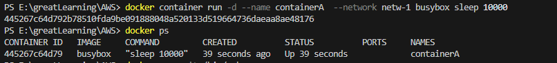

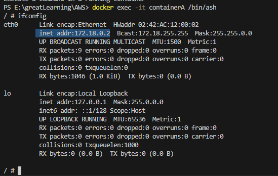

### docker container run -d --name containerB --network netw-1 busybox sleep 10000

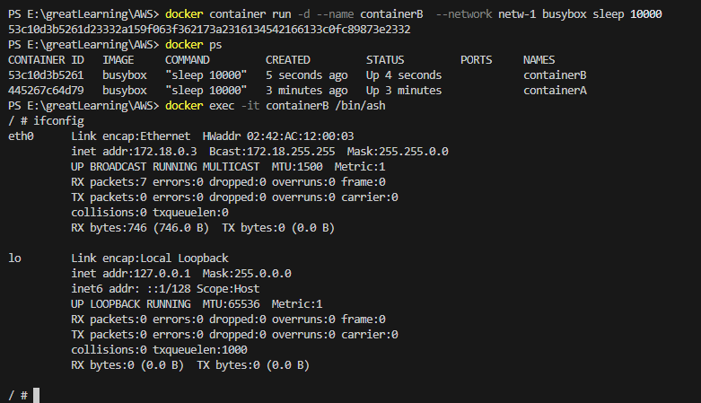

2 containers are added on same network

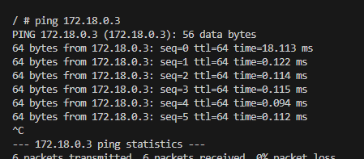

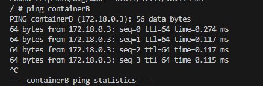

Ping from container A to B with its IP address or container name, both is possible

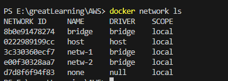

Added network 2 as bridge

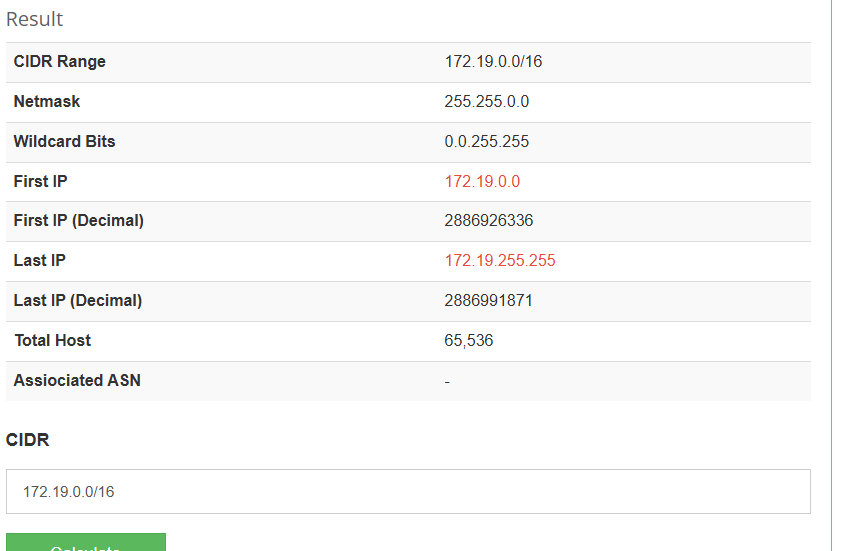

### docker container run -d --name containerC --network netw-2 busybox sleep 10000

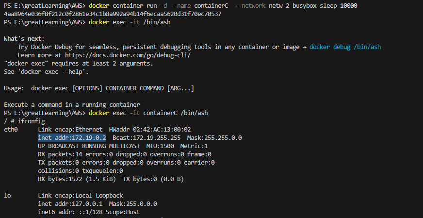

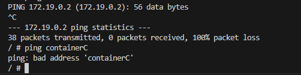

So, the default behaviour is containers of network 1 won't be able to connect
with network 2
