# Docker commands

## docker info

To get docker details and also its working for us or not

## docker pull hello-world:latest

To download a dockerized image

We can find out the images in Docker Hub

docker pull packageName:tagName

if we don't use tagName, by default it will use latest

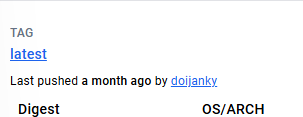

## docker images

To see all the images in our container

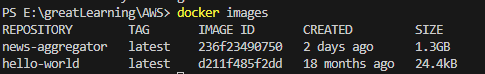

docker images hello-world -> to see specific image

## docker container run hello-world/ docker run hello-world

To run a image

Container run specifies we want to run the container

## docker ps

To see actively running processes

## docker ps -a/--all

To see all the processes

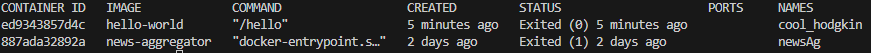

if we don't give names while running a container, it will by default give a name to the container

## docker container run --name subendu hello-world

naming the container

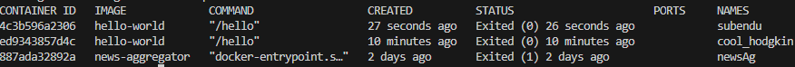

## docker container run --name hellow-web-instance-1 -p 3333:80 nginxdemos/hello

-p -> port mapping

3333:80 -> port for owr(host) machine: port for docker(guest) machine

    In guest machine its running on port 80 
    For accessing that port we also need a port

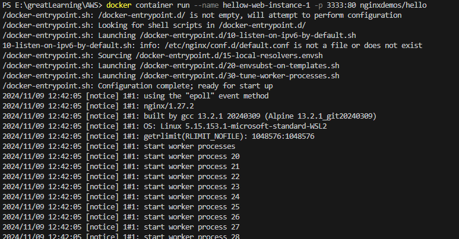

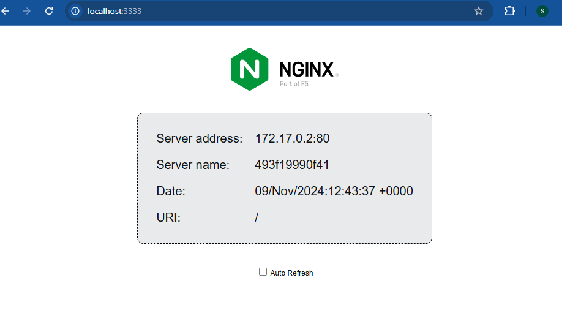

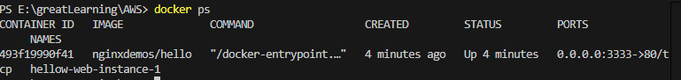

## docker container run --name hellow-web-instance-2 -d -p 3334:80 nginxdemos/hello

returns long format of containerId

-d -> detached mode

With this, we can use the same terminal with the process running

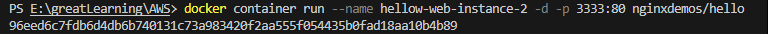

## docker container logs containerId

To see the logs of any container

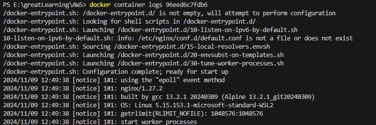

## docker kill/stop containerId

To kill any process

We can add multiple containerId seprated by spaces

## docker run -d -p 30:80 yeasy/simple-web:latest

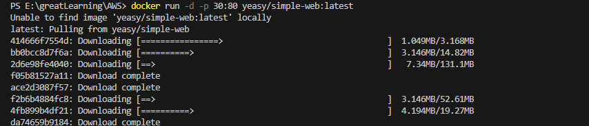

On this, the image was not found locally, so it checked in docker hub if present.
After found, it started downloading and started in detached mode

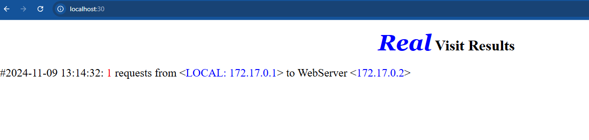

## docker run -d -e MYSQL_ROOT_PASSWORD=abcd -p 1234:3306 --name mysql_server_docker mysql:latest

-e -> is for environment here

## docker exec -it containerId

-it -> iteractive mode

For interacting with the container

## docker exec -it containerId /bin/bash

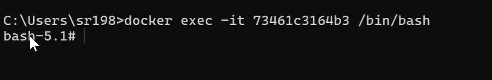

By this, bash command line will be opened. So, we can iteract from there

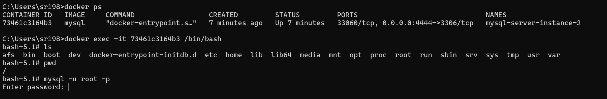

Add the password added in env variable for mysql container while running

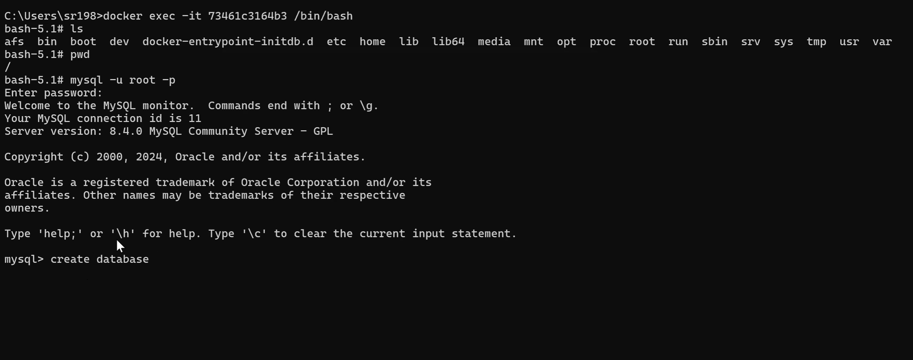

## docker remove containerId

To remove a container

We can add multiple containerId seprated by spaces

## docker rmi imageId/image

To remove image

We can add multiple imageName/imageId seprated by spaces

## docker commit [OPTIONS] CONTAINER [REPOSITORY[:TAG]]

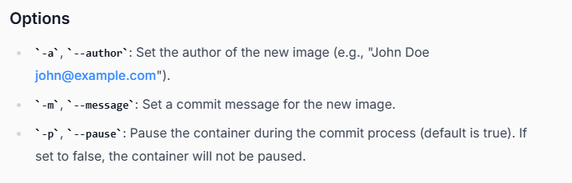

When we run a container and do some process, the data of it get started
saving on our local machine

We can save that data using commit
