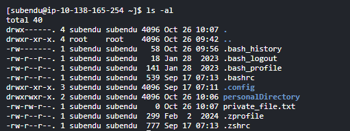
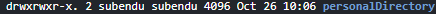

# Linux commands

## Path

Absolute path -> exact reference path from where it will be correct for every other user

Relative path -> Reference path for current user only

## System commands

uname -> displays the name of the operating system

uname -a/-all -> displays more detailed information about the system

uname -p -> will give the processor

ifconfig -> to get ip address

pwd-> present working directory

man ls -> to get the documentation

man uname -> to get documentation of any command

## File System commands

cd -> change directory 
cd / -> to go to root directory 
cd .. -> to go one level up 
cd ~/ -> to go to home directory

ls -> list the files & folders in current directory 
ls -l -> give more details about the file in the current directory

mkdir folderName -> to create a folder

touch fileName -> to create a file

echo anyWord/`command` -> to print out 
echo `uname -a` > file1.txt -> to add the content in the file

cat filename.txt -> to read the documentation inside the file

cat > file -> removes all content from the file & to write in the file directly

more file -> output the contents

head file -> output first 10 lines of the file

tail file -> output last 10 lines of the file 
tail -f file -> output the contents of the file as it grows, starting with last 10 lines

cp sourceName destintionName -> copy the file contents

mv file1.txt dir-1/ -> to move the file 
mv cloudComputing cloudShell-user -> to rename the file

ln -s file link -> create symbolic link to the file

rm fileName -> to remove the file

more fileName -> output the contents of the file, by pressing enter we can go through whole content

find /home/cloudshell-user/ -name "\*.txt" -> will search within the given path 
find /home/cloudshell-user/ -name "cp\_\*.txt" 
find / -name "cp\_\*.txt" -> throughout the machine 
find / -mtime -2 -> last modified 2 days before 
find / -mtime -2 -size +1M -> last modified 2 days before and size=1mb 
find /home/cloudshell-user/ -amin -2 -> 2 minutes before

## File Permissions

sudo useradd subendu -> to add user

sudo yum install -y passwd -> to install passwd package

sudo passwd subendu -> to change user password 
(subendudas)

sudo su subendu -> to get into other user

logout/exit -> to logout from current user

sudo usermod -a -G wheel subendu -> to add user in sodoers file

sudo su - -> to go to root directory

ls -al -> will show you the permissions on the directory
 
drwx------ -> 10 characters -> 1st one will say wheter its file or a directory
d -> directory
  
rwx(1st 3 after d) -> user will be able to read,write & execute(installable) 
rwx(next 3) -> users in this group will be able to do this 
r-x(last 3) -> other won't be able to write but they can read and execute
